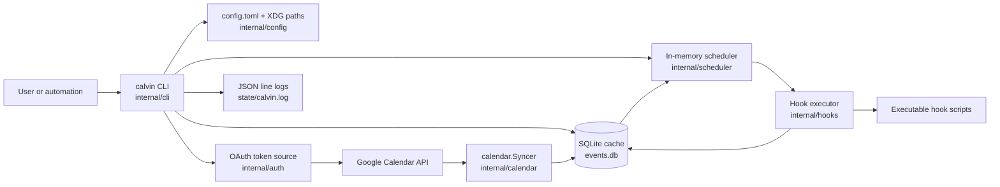
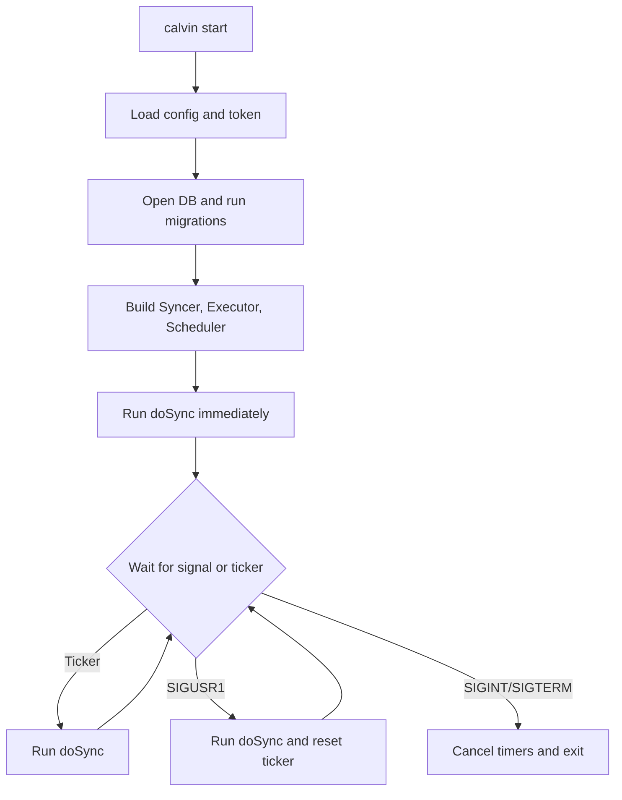
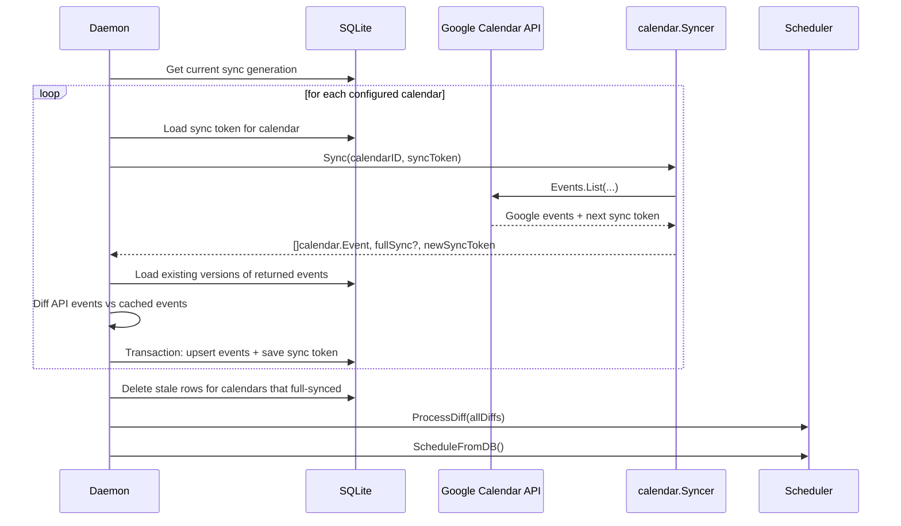
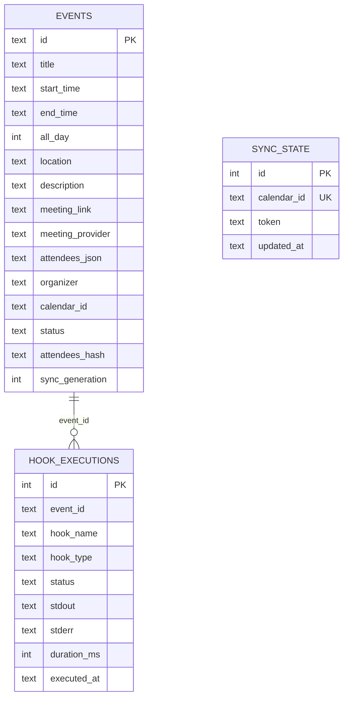
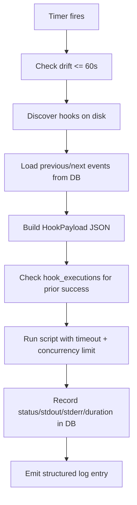

# Calvin Architecture

Calvin is a local Go CLI and daemon that mirrors a slice of Google Calendar into SQLite, turns upcoming event times into in-memory timers, and executes user-provided shell hooks when those timers fire.

The design is intentionally simple:

- `internal/cli` is the imperative shell and process orchestration layer.
- `internal/calendar` owns Google Calendar integration and event normalization.
- `internal/db` is the persistence boundary and source of truth for cached events and hook history.
- `internal/scheduler` converts cached events into timers.
- `internal/hooks` discovers executable scripts, builds hook payloads, and runs them safely.
- `internal/auth`, `internal/config`, and `internal/logging` provide cross-cutting infrastructure.

## System Overview

## Runtime Shape

Calvin has two main operating modes.

1. Command mode
   Commands like `events`, `week`, `status`, `logs`, and `schema` run once and exit.
2. Daemon mode
   `calvin start` becomes a long-running loop that syncs calendars, refreshes the cache, updates timers, and executes hooks.

The entry point is small. `main.go` sets version metadata, calls `cli.Execute()`, and converts CLI errors into exit codes.

## Package Responsibilities

| Package | Responsibility | Notes |
| --- | --- | --- |
| `main` | Process entry point | No domain logic. |
| `internal/cli` | Cobra command tree, daemon lifecycle, human/JSON output | The main orchestration layer. |
| `internal/config` | Config loading, validation, path resolution | Defaults to XDG-style config/data/state directories. |
| `internal/auth` | OAuth flow, token loading, token source creation | Produces the token source used by Google API clients. |
| `internal/calendar` | Event fetch, normalization, diffing, free-time logic | Owns translation from Google types to Calvin types. |
| `internal/db` | SQLite schema, migrations, queries, transactions | Source of truth for cached events and hook execution history. |
| `internal/scheduler` | Timer management for upcoming events | Only schedules a near-term window from the DB cache. |
| `internal/hooks` | Hook discovery, payload construction, execution, test helpers | Runs scripts with bounded concurrency and timeout controls. |
| `internal/logging` | JSON line logging | File-backed in daemon mode, stdout fallback elsewhere. |

## Files and State

`internal/config` centralizes where Calvin stores state:

- Config: `~/.config/calvin/config.toml`
- Hooks: `~/.config/calvin/hooks/<hook-type>/...`
- Data: `~/.local/share/calvin/events.db`
- OAuth token: `~/.local/share/calvin/token.json`
- Logs: `~/.local/state/calvin/calvin.log`
- PID file: `~/.local/state/calvin/calvin.pid`

`calvin init` scaffolds those directories, writes a default config, and creates example hooks.

## Core Domain Model

The normalized event model lives in `internal/calendar/types.go`.

`calendar.Event` is Calvin's internal event type. It strips Google-specific API shapes down to the fields the app actually needs:

- identity: `ID`
- timing: `Start`, `End`, `AllDay`
- metadata: `Title`, `Location`, `Description`, `Organizer`, `Calendar`, `Status`
- meeting context: `MeetingLink`, `MeetingProvider`
- attendees: `[]Attendee`

Hook execution does not receive raw `calendar.Event`. It receives `calendar.HookPayload`, which is a JSON-oriented shape with:

- string-formatted time fields
- `hook_type`
- optional `meeting_link`
- optional `previous_event` and `next_event`

That separation is useful because the database and scheduling logic work with strong Go types, while scripts receive a stable, script-friendly JSON contract.

## Startup and Steady-State Flow

`calvin start` is the architectural center of the app. The control flow is in `internal/cli/start_cmd.go`.

At startup, Calvin:

1. Loads and validates config.
2. Verifies initialization and OAuth token presence.
3. Prevents duplicate daemons via the PID file.
4. Initializes logging.
5. Opens the SQLite database and runs migrations if needed.
6. Prunes old hook execution rows.
7. Builds the Google token source and `calendar.Syncer`.
8. Creates the hook executor and scheduler.
9. Runs an immediate sync.
10. Enters a ticker-driven loop, with `SIGUSR1` forcing an immediate sync and `SIGINT`/`SIGTERM` triggering shutdown.

### Daemon Control Flow

## Data Flow: Sync Cycle

The sync cycle is deliberately staged. Calvin does not fire hooks directly from API responses. It first normalizes and persists state, then schedules from the persisted view.

### Per-sync sequence

### Important details

- The Google API boundary is `calendar.Syncer`.
- `calendar.Syncer.Sync()` uses incremental sync when a sync token exists.
- If Google invalidates the sync token with a `410 Gone`, Calvin retries with a full sync.
- First-time full syncs only fetch a 7-day window starting from `now`.
- Incremental syncs rely on Google's sync token and are not constrained by that initial 7-day window.
- Events are normalized before they touch the rest of the system.
- Diffing happens before upsert so the scheduler can distinguish added, modified, and deleted events.
- Full-sync cleanup removes rows whose `sync_generation` is older than the current generation for that calendar.

## Event Normalization

`internal/calendar/sync.go` translates Google Calendar events into Calvin events.

Key transformations:

- Timed events are parsed from RFC3339 datetimes.
- All-day events are parsed as local dates and flagged with `AllDay=true`.
- Meeting links are inferred from Google Meet, conference entry points, or known URLs in `Location`.
- Attendee lists are copied into Calvin's smaller `Attendee` type.
- Missing Google status defaults to `confirmed`.

This keeps the rest of the application insulated from Google API structs.

## Persistence Model

SQLite is not just a cache implementation detail. It is the app's operational state boundary.

Calvin stores:

- cached event rows
- per-calendar sync tokens
- hook execution history

This is what lets read-only commands answer quickly without hitting Google, and it is what the scheduler uses as its scheduling source.

### Database Schema

### Why the DB matters architecturally

- `events` is the shared truth between sync, scheduling, and read-only CLI commands.
- `sync_state` makes incremental sync possible on a per-calendar basis.
- `hook_executions` provides observability and deduplication.

`internal/db` also owns schema migrations and transaction boundaries. The daemon writes events and sync tokens inside a single transaction per calendar sync.

## Scheduling Model

The scheduler is intentionally in-memory and disposable. It does not persist timers.

`scheduler.ScheduleFromDB()` loads upcoming cached events and creates up to three timers per event:

- `before-event-start`
- `on-event-start`
- `on-event-end`

Important characteristics:

- Scheduling is rebuilt from the database, not from a separate timer store.
- Only near-term events are scheduled: from one hour in the past to roughly two hours plus pre-event lead time into the future.
- Modified and deleted events cancel existing timers.
- Added events are not scheduled directly from diffs; the daemon always calls `ScheduleFromDB()` after processing diffs.
- A stale-timer guard drops executions whose drift is more than 60 seconds late.

That design keeps the scheduler simple: SQLite holds durable state, while timers are just a short-lived projection of that state.

## Hook Discovery and Execution

Hooks are plain executable files under `hooks/<hook-type>/`.

Discovery is filesystem-based:

- valid types are fixed in `hooks.ValidTypes`
- hidden files are ignored
- non-executable files are skipped
- hooks are sorted by name for deterministic ordering

At fire time, the scheduler rescans the hooks directory and selects the scripts for the fired hook type. This means hook changes can take effect without restarting the daemon.

### Execution flow

### Hook runtime contract

Each hook gets:

- JSON payload on `stdin`
- `CALVIN_EVENT_ID`
- `CALVIN_HOOK_TYPE`
- `CALVIN_CONFIG_DIR`
- `CALVIN_DATA_DIR`
- `CALVIN_EVENT_FILE` pointing to a temp file with the same JSON payload

Execution safeguards in `internal/hooks/execute.go`:

- bounded concurrency via a semaphore
- per-hook timeout via `context.WithTimeout`
- process-group kill on cancellation
- capped stdout/stderr capture size
- panic recovery in the Go executor goroutine

Deduplication is intentionally narrow: a hook is skipped only if the same `(event_id, hook_name, hook_type)` already has a `success` row in `hook_executions`. Failed or timed-out hooks do not count as already executed.

## Read Path vs Write Path

One useful way to understand Calvin is to separate the write path from the read path.

### Write path

1. Fetch from Google.
2. Normalize to `calendar.Event`.
3. Persist to SQLite.
4. Project into timers.
5. Execute hooks.
6. Persist hook results.

### Read path

Most user-facing read commands use SQLite directly:

- `events`
- `week`
- `next`
- `free`
- `status`
- event-detail mode of `events <id>`

That means the normal UX is based on Calvin's local cache, not live API calls.

Exceptions:

- `auth` is interactive and talks to Google OAuth.
- `test` may use cached event data, fetch the next real event from Google, or fall back to mock data.

## Agent and Machine-Readable Surface

This repo has a secondary architectural concern: it exposes structured CLI output for automation.

`internal/cli/root.go` resolves output mode from:

- `--json`
- `--output json`
- `CALVIN_OUTPUT=json`

Commands like `commands`, `describe`, `schema`, `events`, `logs`, and `status` can return stable JSON. In practice, Calvin has two interfaces layered on the same command tree:

- human-oriented terminal output
- machine-oriented structured output

That is why output-mode resolution sits in the root command rather than inside individual business functions.

## Error Handling and Failure Boundaries

A few failure boundaries matter when modifying the system.

- Google API failures stay at the sync boundary and are logged per calendar.
- Event writes and sync token updates happen transactionally per calendar.
- Timer state is recoverable because it is rebuilt from SQLite.
- Hook failures do not stop the daemon; they are logged and stored in `hook_executions`.
- Token problems are discovered either during `auth`/`doctor`/`status` checks or the next sync.

One subtle but important design choice: scheduling always follows persistence. If the process dies after syncing but before scheduling, the next daemon start can rebuild timers from the database.

## Architectural Strengths

- Clear boundary between external systems and internal types.
- SQLite gives the daemon a durable working set and a cheap read model.
- The scheduler is simple because it projects from persisted state instead of owning durable scheduling state.
- Hooks remain dumb Unix executables with a stable JSON contract.
- The command layer can serve both humans and agents without changing the domain model.

## Things To Keep In Mind When Changing It

- Avoid bypassing SQLite for live data in normal commands unless you want to change the product model.
- Changes to `calendar.Event` often ripple into DB schema, diffing, scheduling, and hook payloads.
- Hook deduplication semantics live in the database and executor together, not in the scheduler alone.
- Timer correctness depends on event time handling, especially all-day behavior and local time parsing.
- Sync behavior is per calendar, but scheduling and hook execution operate on the combined cached event set.

## Mental Model

The simplest accurate mental model is:

1. Calvin mirrors calendar state into SQLite.
2. The daemon turns that cached state into short-lived timers.
3. Timer firings turn into JSON payloads for executable scripts.
4. Hook results go back into SQLite and logs.

If you keep that loop in mind, most of the codebase becomes easy to place:

- `cli` drives the loop
- `calendar` imports state
- `db` persists state
- `scheduler` projects state into time
- `hooks` projects time into side effects
